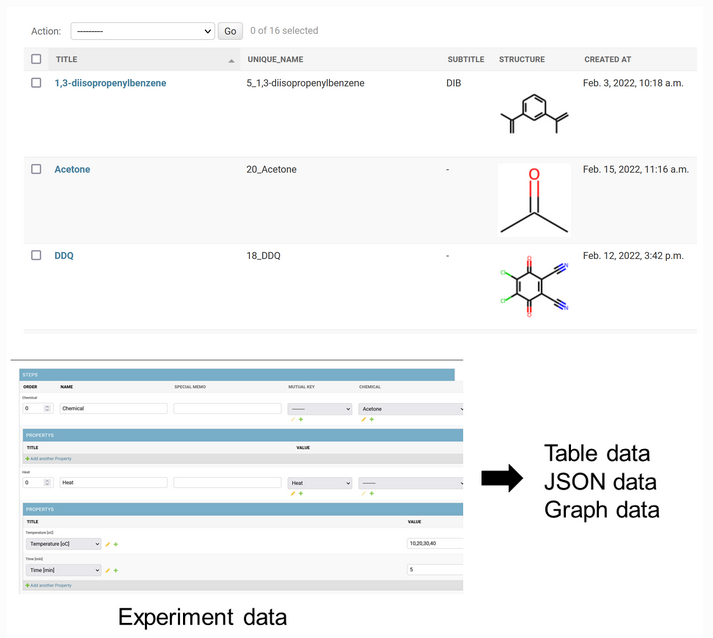

# FlowMaterGUI
- Flowchart of Materials with Graphical User Interface (GUI)

# What is it?
- This is a Web-based digital labolatory notebook, compatible with machine learning
    -   Designed for chemistry and material science



# How to use?
- [DEMO server](https://flowmatergui-hatakeyama.herokuapp.com/) is available! (just wait for ca. 30 seconds to load the page)
    - IMPORTANT NOTES about the server
        - Login info
            - username: user
            - pass: user
        - Database will reset every day
        - [Table data exporting module](https://kanhatakeyama.github.io/expmanager_document/docs/experiment/about.html#convert-to-table-data) is unavailable due to a server issue (To be fixed)
        - Response is rather slow because it runs on a free server
        - You cannot use "save as" function due to a bug of django-nested-inline

- [Read Document](https://kanhatakeyama.github.io/expmanager_document/) for the system 

# Related paper
- https://chemrxiv.org/engage/chemrxiv/article-details/61ee04a671868d22fdbc8856

# Installization
## For beginners
- The system works on [Django framework](https://docs.djangoproject.com) of Python
    - Basic knowledge of Python and Django would be needed to run the program

## Setup
- Sample SQLite3 database is included in this repo.
- I recommend to use other SQL (e.g., PostgreSQL) for actual use

### On your server 
1. Clone this repositry
2. Setup Python environment according to "requirements.yml"
3. Run server
    - ```python manage.py runserver```
    - Or, by other command, such as 
        - ```gunicorn -b :8765 config.wsgi```
4. Access website
5. You can login the site with
    - Username: user
    - Pass: user

### On [Heroku](https://heroku.com/) (via docker)
1. Clone this repositry
2. Login heroku via CLI
3. Run the following commands
    - ```heroku create [your heroku project name]```
    - (Git your modifications)
    - ```heroku container:push web -a [your heroku project name]```
    - ```heroku container:release web -a [your heroku project name]```


## Major packages to be installed
- Main framwrok
    - ```conda create -n django python=3.9```
    - ```pip install django-nested-inline```
    - ```pip install django-bootstrap5```
    - ```pip install django-ckeditor```
    - ```pip install django-import-export```
    - ```pip install django-cleanup```
    - ```conda install -c anaconda django -y```
    - ```conda install -c conda-forge rdkit -y```
    - ```conda install -c anaconda pillow -y```
    - ```conda install -c anaconda networkx -y```
    - ```conda install dtale -c conda-forge -y```
- Additional package to treat [Polymer structures](https://github.com/KanHatakeyama/PolyMolParser) (if needed)
    - ```pip install git+https://github.com/KanHatakeyama/PolyMolParser.git```


## You should modify bug of the following package
- django-nested-inline (0.4.4)
        - Modification is needed to avoid a bug during saving records with "save as" option
- [Click here](https://github.com/s-block/django-nested-inline/issues/139)
         to see the fix of the bug

# Version
- 2022.2.17 First prototype
- 2022.2.18 Add Heroku and Docker info.
- 2022.2.19 Implement csv export (default)

# Author
- Kan Hatakeyama-Sato
- Waseda University
- https://kanhatakeyama.github.io/
- satokan@toki.waseda.(japan)